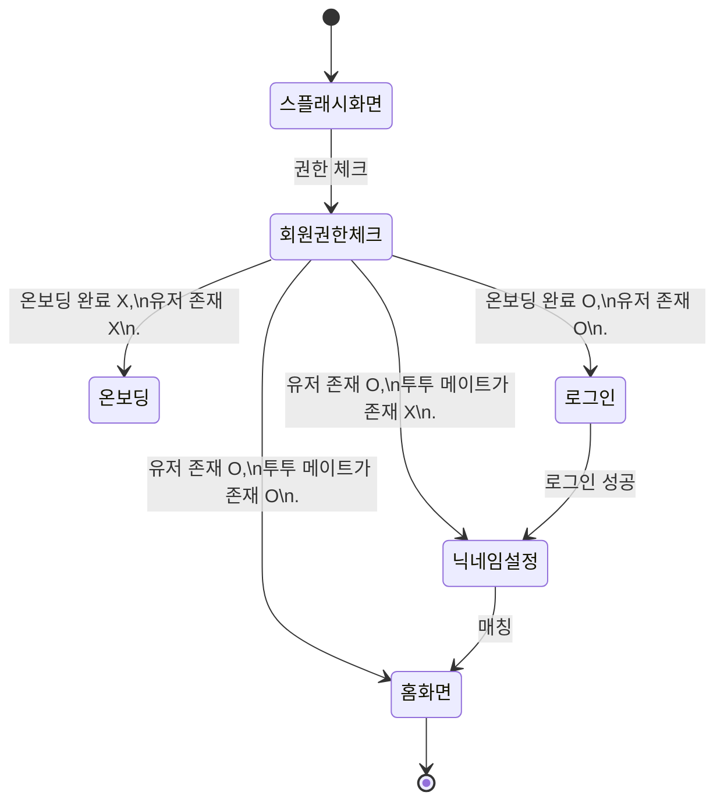
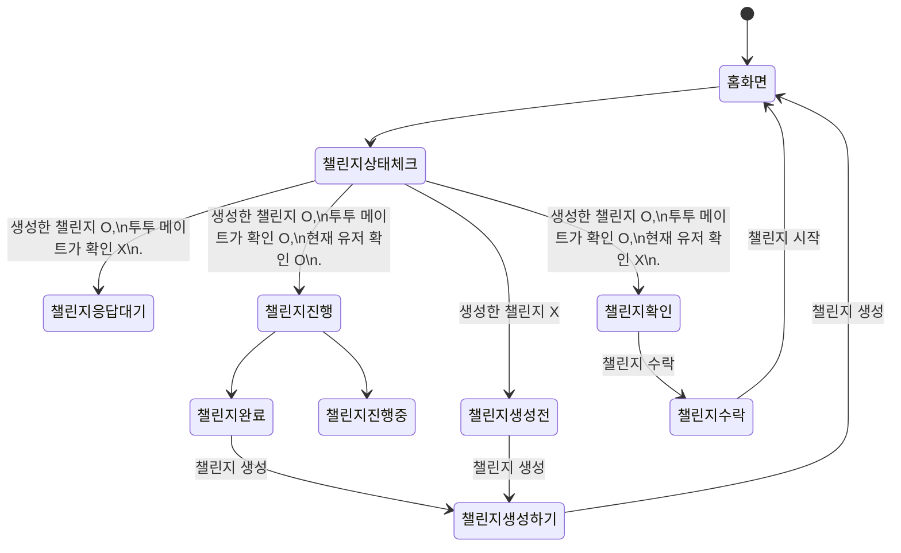

# 유저 상태 다이어그램

```mermaid
stateDiagram-v2
    [*] --> 스플래시화면
    스플래시화면 --> 회원권한체크 : 권한 체크
    회원권한체크 --> 온보딩 : 온보딩 완료 X,\n유저 존재 X\n.
    회원권한체크 --> 로그인 : 온보딩 완료 O,\n유저 존재 O\n.
    회원권한체크 --> 닉네임설정 : 유저 존재 O,\n투투 메이트가 존재 X\n.
    회원권한체크 --> 홈화면 : 유저 존재 O,\n투투 메이트가 존재 O\n.
    로그인 --> 닉네임설정 : 로그인 성공
    닉네임설정 --> 홈화면 : 매칭
    홈화면 --> [*]
```

# 챌린지 상태 다이어그램

```mermaid
stateDiagram-v2
    [*] --> 홈화면
    홈화면 --> 챌린지상태체크
    챌린지상태체크 --> 챌린지생성전 : 생성한 챌린지 X
    챌린지상태체크 --> 챌린지응답대기 : 생성한 챌린지 O,\n투투 메이트가 확인 X\n.
    챌린지상태체크 --> 챌린지확인 : 생성한 챌린지 O,\n투투 메이트가 확인 O,\n현재 유저 확인 X\n.
    챌린지상태체크 --> 챌린지진행 : 생성한 챌린지 O,\n투투 메이트가 확인 O,\n현재 유저 확인 O\n.
    챌린지진행 --> 챌린지진행중
    챌린지진행 --> 챌린지완료
    챌린지완료 --> 챌린지생성하기 : 챌린지 생성
    챌린지생성전 --> 챌린지생성하기 : 챌린지 생성
    챌린지확인 --> 챌린지수락 : 챌린지 수락
    챌린지생성하기 --> 홈화면 : 챌린지 생성
    챌린지수락 --> 홈화면 : 챌린지 시작
```
