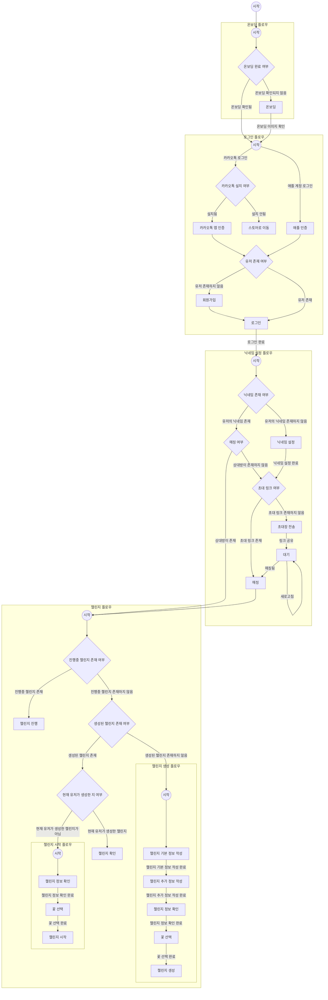

# 유저 플로우

```mermaid
graph TD
    A((시작)) --> FF
    subgraph 온보딩 플로우
    FF((시작)) --> GG{온보딩 완료 여부}
    GG -->|온보딩 확인되지 않음| B[온보딩]
    end
    GG -->|온보딩 확인됨| BB
    B -->|온보딩 이미지 확인| BB((시작))
    subgraph 로그인 플로우
    YY -->|유저 존재하지 않음| AA[회원가입] --> C
    BB -->|카카오톡 로그인| D{카카오톡 설치 여부}
    D -->|설치됨| E[카카오톡 앱 인증]
    D -->|설치 안됨| F[스토어로 이동]
    BB -->|애플 계정 로그인| G[애플 인증]
    E & G --> YY{유저 존재 여부} -->|유저 존재| C[로그인]
    end
    C -->|로그인 완료| I((시작))
    subgraph 닉네임 설정 플로우
    I --> KK{닉네임 존재 여부}
    KK -->|유저의 닉네임 존재하지 않음| MM[닉네임 설정]
    KK -->|유저의 닉네임 존재| JJ{매칭 여부}
    JJ -->|상대방이 존재하지 않음| Z
    MM -->|닉네임 설정 완료| Z{초대 링크 여부}
    Z -->|초대 링크 존재| Y[매칭]
    Z -->|초대 링크 존재하지 않음| CC[초대장 전송] -->|링크 공유| ZZ[대기]
    ZZ -->|새로고침| ZZ
    ZZ -->|매칭됨| Y
    end
    JJ -->|상대방이 존재| AAA
    Y --> AAA
    subgraph 챌린지 플로우
    AAA((시작)) --> BBB{진행중 챌린지 존재 여부}
    BBB -->|진행중 챌린지 존재| CCC[챌린지 진행]
    BBB -->|진행중 챌린지 존재하지 않음| QQQ{생성된 챌린지 존재 여부}
    QQQ -->|생성된 챌린지 존재| HHH{현재 유저가 생성한 지 여부}
    QQQ -->|생성된 챌린지 존재하지 않음| DDD
    HHH -->|현재 유저가 생성한 챌린지| NNN[챌린지 확인]
    HHH -->|현재 유저가 생성한 챌린지가 아님| OOO
    subgraph 챌린지 생성 플로우
    DDD((시작)) --> VV
    VV[챌린지 기본 정보 작성] -->|챌린지 기본 정보 작성 완료| XX[챌린지 추가 정보 작성]
    XX -->|챌린지 추가 정보 작성 완료| QQ[챌린지 정보 확인]
    QQ -->|챌린지 정보 확인 완료| TT[꽃 선택]
    TT -->|꽃 선택 완료| RR[챌린지 생성]
    end
    subgraph 챌린지 시작 플로우
    OOO((시작)) --> EE[챌린지 정보 확인] --> |챌린지 정보 확인 완료| NN[꽃 선택]
    NN -->|꽃 선택 완료| UU[챌린지 시작]
    end
end
```
