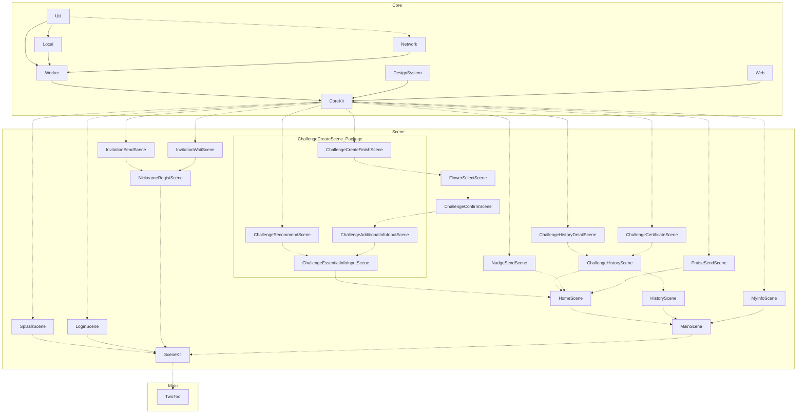

# TwoToo_iOS

## ⚙️ Project Setting

### 템플릿 다운로드 가이드
```
cd ./Templates
make
```

## 🏛️ Structure


```mermaid
graph 
    direction TB
    subgraph Core
        direction TB
        CoreKit
        DesignSystem
        Network
        Util
        Local
        Worker
        Web
    end
    subgraph Scene
        direction TB
        SceneKit
        SplashScene
        LoginScene
        NicknameRegistScene
        InvitationSendScene
        InvitationWaitScene
        MainScene
        HomeScene
        ChallengeEssentialInfoInputScene
        ChallengeAdditionalInfoInputScene
        ChallengeRecommendScene
        ChallengeConfirmScene
        FlowerSelectScene
        ChallengeCreateFinishScene
        ChallengeCertificateScene
        ChallengeHistoryScene
        ChallengeHistoryDetailScene
        NudgeSendScene
        PraiseSendScene
        HistoryScene
        MyInfoScene

        subgraph ChallengeCreateScene_Package
            ChallengeEssentialInfoInputScene
            ChallengeAdditionalInfoInputScene
            ChallengeRecommendScene
            ChallengeCreateFinishScene
        end

    end
    subgraph Main
        direction TB
        TwoToo
    end

    Util -.-> Local
    Util -.-> Network
    Util & Local & Network --> Worker
    Worker & DesignSystem & Web --> CoreKit
    SplashScene & LoginScene & NicknameRegistScene & MainScene -.-> SceneKit
    InvitationSendScene & InvitationWaitScene -.-> NicknameRegistScene
    HomeScene & HistoryScene & MyInfoScene -.-> MainScene
    ChallengeRecommendScene & ChallengeAdditionalInfoInputScene -.-> ChallengeEssentialInfoInputScene
    ChallengeCreateFinishScene -.-> FlowerSelectScene
    ChallengeHistoryDetailScene -.-> ChallengeHistoryScene
    ChallengeCertificateScene -.-> ChallengeHistoryScene
    ChallengeEssentialInfoInputScene & ChallengeHistoryScene & NudgeSendScene & PraiseSendScene -.-> HomeScene
    ChallengeHistoryScene -.-> HistoryScene
    ChallengeConfirmScene -.-> ChallengeAdditionalInfoInputScene
    FlowerSelectScene -.-> ChallengeConfirmScene
    CoreKit -.-> ChallengeCreateFinishScene & ChallengeRecommendScene & MyInfoScene & PraiseSendScene & ChallengeCertificateScene & ChallengeHistoryDetailScene & NudgeSendScene & SplashScene & LoginScene & InvitationSendScene & InvitationWaitScene
    SceneKit -.-> TwoToo
```

## 📊 Branch Rule


