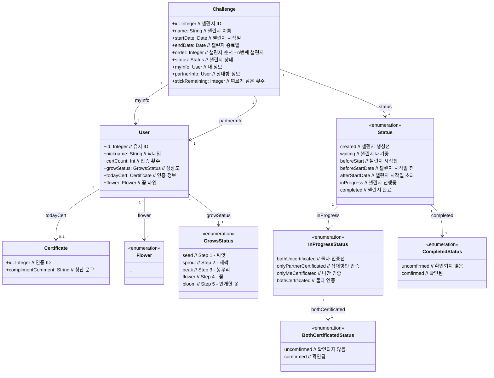
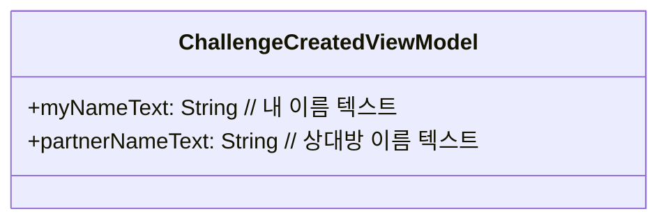
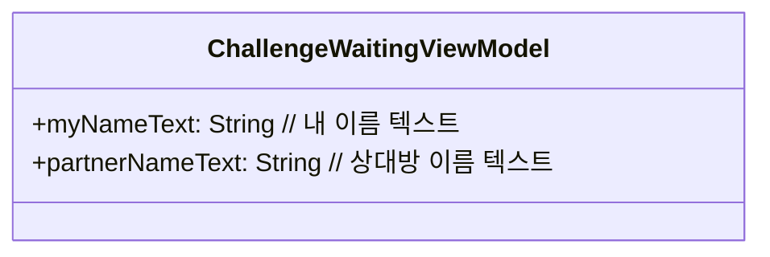
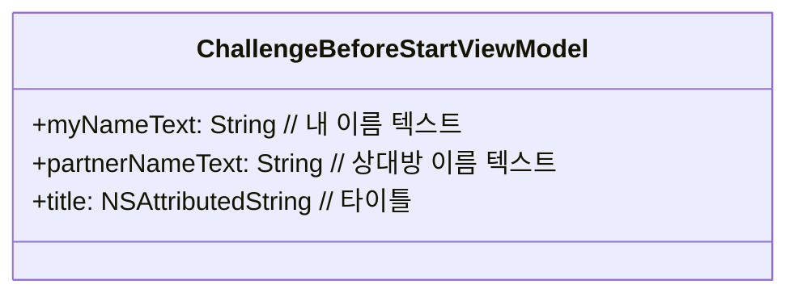
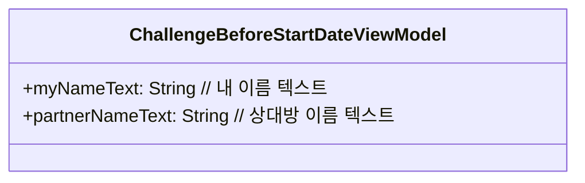
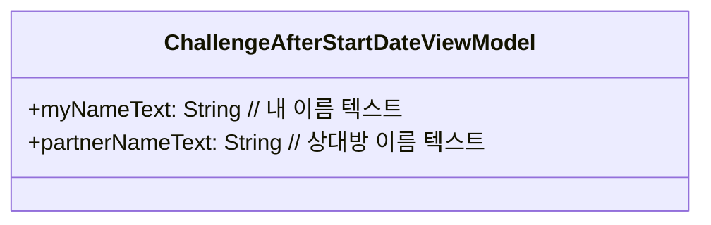
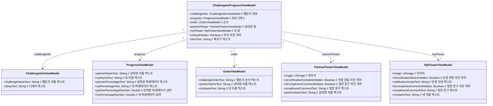
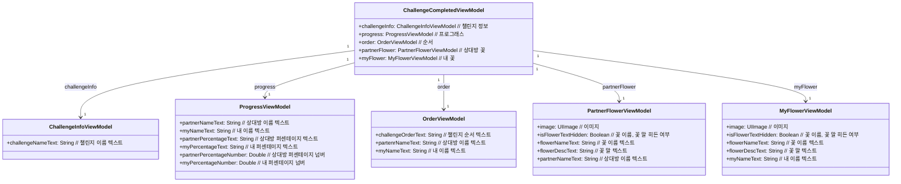
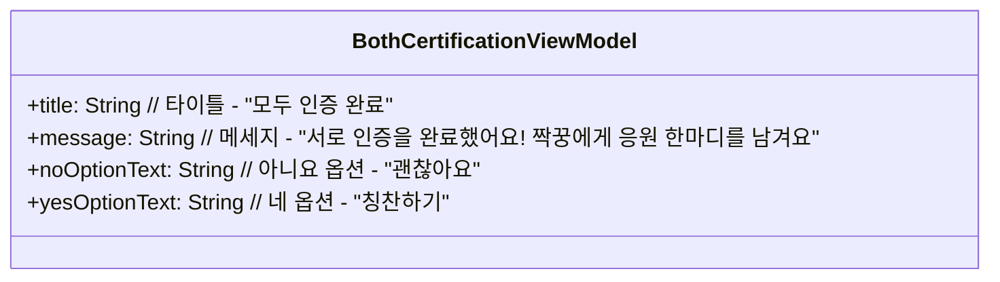
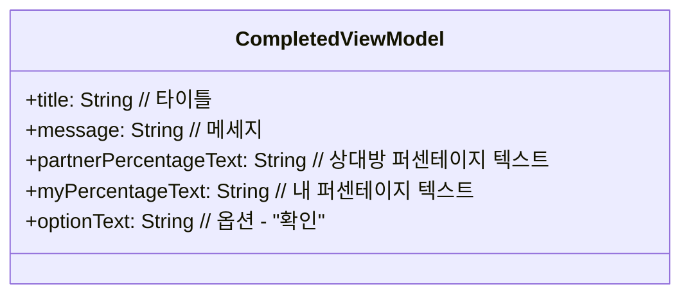

# HomeScene

## Entity

### 챌린지

```mermaid
classDiagram
    class Challenge {
        +id: Integer // 챌린지 ID
        +name: String // 챌린지 이름
        +startDate: Date // 챌린지 시작일
        +endDate: Date // 챌린지 종료일
        +order: Integer // 챌린지 순서 - n번째 챌린지
        +status: Status // 챌린지 상태
        +myInfo: User // 내 정보
        +partnerInfo: User // 상대방 정보
        +stickRemaining: Integer // 찌르기 남은 횟수
    }
    Challenge "1" --> "1" User: myInfo
    Challenge "1" --> "1" User: partnerInfo
    Challenge "1" --> "1" Status: status

    class User {
        +id: Integer // 유저 ID
        +nickname: String // 닉네임
                +certCount: Int // 인증 횟수
                +growStatus: GrowsStatus // 성장도
        +todayCert: Certificate // 인증 정보
        +flower: Flower // 꽃 타입
    }
    User "1" --> "0..1" Certificate: todayCert
    User "1" --> "*" Flower: flower
        User "1" --> "1" GrowsStatus: growStatus

    class Certificate {
        +id: Integer // 인증 ID
        +complimentComment: String // 칭찬 문구
    }

        class GrowsStatus {
                <<enumeration>>
                seed // Step 1 - 씨앗
                sprout // Step 2 - 새싹
                peak // Step 3 - 봉우리
                flower // Step 4 - 꽃
                bloom // Step 5 - 만개한 꽃
        }

    class Flower {
                <<enumeration>>
        ...
    }

    class Status {
                <<enumeration>>
        created // 챌린지 생성전
                waiting // 챌린지 대기중
                beforeStart // 챌린지 시작전
                beforeStartDate // 챌린지 시작일 전
        afterStartDate // 챌린지 시작일 초과
        inProgress // 챌린지 진행중
        completed // 챌린지 완료
    }

        Status "1" --> "1" InProgressStatus: inProgress
        Status "1" --> "1" CompletedStatus: completed

        class InProgressStatus {
        <<enumeration>>
        bothUncertificated // 둘다 인증전
        onlyPartnerCertificated // 상대방만 인증
        onlyMeCertificated // 나만 인증
        bothCertificated // 둘다 인증
        }

        InProgressStatus "1" --> "1" BothCertificatedStatus: bothCertificated

        class BothCertificatedStatus {
                <<enumeration>>
                uncomfirmed // 확인되지 않음
                comfirmed // 확인됨
        }

        class CompletedStatus {
                <<enumeration>>
                uncomfirmed // 확인되지 않음
                comfirmed // 확인됨
        }
```

### 챌린지 생성 전

```mermaid
classDiagram
    class ChallengeCreatedViewModel {
                +myNameText: String // 내 이름 텍스트
                +partnerNameText: String // 상대방 이름 텍스트
    }
```

### 챌린지 대기 중

```mermaid
classDiagram
    class ChallengeWaitingViewModel {
                +myNameText: String // 내 이름 텍스트
                +partnerNameText: String // 상대방 이름 텍스트
    }
```

### 챌린지 시작 전

```mermaid
classDiagram
    class ChallengeBeforeStartViewModel {
        +myNameText: String // 내 이름 텍스트
                +partnerNameText: String // 상대방 이름 텍스트
                +title: NSAttributedString // 타이틀
    }
```

### 챌린지 시작일 전

```mermaid
classDiagram
    class ChallengeBeforeStartDateViewModel {
                +myNameText: String // 내 이름 텍스트
                +partnerNameText: String // 상대방 이름 텍스트
    }
```

### 챌린지 시작일 초과

```mermaid
classDiagram
    class ChallengeAfterStartDateViewModel {
                +myNameText: String // 내 이름 텍스트
                +partnerNameText: String // 상대방 이름 텍스트
    }
```

### 챌린지 진행 중

```mermaid
classDiagram
    class ChallengeInProgressViewModel {
        +challengeInfo: ChallengeInfoViewModel // 챌린지 정보
        +progress: ProgressViewModel // 프로그래스
        +order: OrderViewModel // 순서
        +partnerFlower: PartnerFlowerViewModel // 상대방 꽃
        +myFlower: MyFlowerViewModel // 내 꽃
                +isHeartHidden: Boolean // 하트 히든 여부
        +stickText: String // 찌르기 텍스트
    }
        ChallengeInProgressViewModel "1" --> "1" ChallengeInfoViewModel: challengeInfo
        ChallengeInProgressViewModel "1" --> "1" ProgressViewModel: progress
        ChallengeInProgressViewModel "1" --> "1" OrderViewModel: order
        ChallengeInProgressViewModel "1" --> "1" PartnerFlowerViewModel: partnerFlower
    ChallengeInProgressViewModel "1" --> "1" MyFlowerViewModel: myFlower

    class ChallengeInfoViewModel {
        +challengeNameText: String // 챌린지 이름 텍스트
        +dDayText: String // 디데이 텍스트
    }

    class ProgressViewModel {
        +partnerNameText: String // 상대방 이름 텍스트
        +myNameText: String // 내 이름 텍스트
        +partnerPercentageText: String // 상대방 퍼센테이지 텍스트
        +myPercentageText: String // 내 퍼센테이지 텍스트
        +partnerPercentageNumber: Double // 상대방 퍼센테이지 넘버
        +myPercentageNumber: Double // 내 퍼센테이지 넘버
    }

    class OrderViewModel {
        +challengeOrderText: String // 챌린지 순서 텍스트
        +partenrNameText: String // 상대방 이름 텍스트
        +myNameText: String // 내 이름 텍스트
    }

    class PartnerFlowerViewModel {
        +image: UIImage // 이미지
        +isCertificationCompleteHidden: Boolean // 인증 완료 히든 여부
                +isComplimentCommentHidden: Boolean // 칭찬 문구 히든 여부
                +complimentCommentText: String // 칭찬 문구 텍스트
        +partnerNameText: String // 상대방 이름 텍스트
    }

    class MyFlowerViewModel {
        +image: UIImage // 이미지
        +isCertificationButtonHidden: Boolean // 인증 버튼 히든 여부
        +cetificationGuideText: String // 인증 안내 텍스트
                +isComplimentCommentHidden: Boolean // 칭찬 문구 히든 여부
                +complimentCommentText: String // 칭찬 문구 텍스트
        +myNameText: String // 내 이름 텍스트
    }
```

### 챌린지 완료

```mermaid
classDiagram
    class ChallengeCompletedViewModel {
        +challengeInfo: ChallengeInfoViewModel // 챌린지 정보
        +progress: ProgressViewModel // 프로그래스
        +order: OrderViewModel // 순서
        +partnerFlower: PartnerFlowerViewModel // 상대방 꽃
        +myFlower: MyFlowerViewModel // 내 꽃
    }
        ChallengeCompletedViewModel "1" --> "1" ChallengeInfoViewModel: challengeInfo
        ChallengeCompletedViewModel "1" --> "1" ProgressViewModel: progress
        ChallengeCompletedViewModel "1" --> "1" OrderViewModel: order
        ChallengeCompletedViewModel "1" --> "1" PartnerFlowerViewModel: partnerFlower
    ChallengeCompletedViewModel "1" --> "1" MyFlowerViewModel: myFlower

    class ChallengeInfoViewModel {
                +challengeNameText: String // 챌린지 이름 텍스트
    }

    class ProgressViewModel {
        +partnerNameText: String // 상대방 이름 텍스트
        +myNameText: String // 내 이름 텍스트
        +partnerPercentageText: String // 상대방 퍼센테이지 텍스트
        +myPercentageText: String // 내 퍼센테이지 텍스트
        +partnerPercentageNumber: Double // 상대방 퍼센테이지 넘버
        +myPercentageNumber: Double // 내 퍼센테이지 넘버
    }

    class OrderViewModel {
        +challengeOrderText: String // 챌린지 순서 텍스트
        +partenrNameText: String // 상대방 이름 텍스트
        +myNameText: String // 내 이름 텍스트
    }

    class PartnerFlowerViewModel {
        +image: UIImage // 이미지
                +isFlowerTextHidden: Boolean // 꽃 이름, 꽃 말 히든 여부
                +flowerNameText: String // 꽃 이름 텍스트
                +flowerDescText: String // 꽃 말 텍스트
        +partnerNameText: String // 상대방 이름 텍스트
    }

    class MyFlowerViewModel {
        +image: UIImage // 이미지
        +isFlowerTextHidden: Boolean // 꽃 이름, 꽃 말 히든 여부
                +flowerNameText: String // 꽃 이름 텍스트
                +flowerDescText: String // 꽃 말 텍스트
        +myNameText: String // 내 이름 텍스트
    }
```

### 둘다 인증 팝업

```mermaid
classDiagram
    class BothCertificationViewModel {
        +title: String // 타이틀 - "모두 인증 완료"
                +message: String // 메세지 - "서로 인증을 완료했어요! 짝꿍에게 응원 한마디를 남겨요"
                +noOptionText: String // 아니요 옵션 - "괜찮아요"
                +yesOptionText: String // 네 옵션 - "칭찬하기"
    }
```

### 챌린지 완료 팝업

```mermaid
classDiagram
    class CompletedViewModel {
        +title: String // 타이틀
                +message: String // 메세지
                +partnerPercentageText: String // 상대방 퍼센테이지 텍스트
                +myPercentageText: String // 내 퍼센테이지 텍스트
                +optionText: String // 옵션 - "확인"
    }
```
