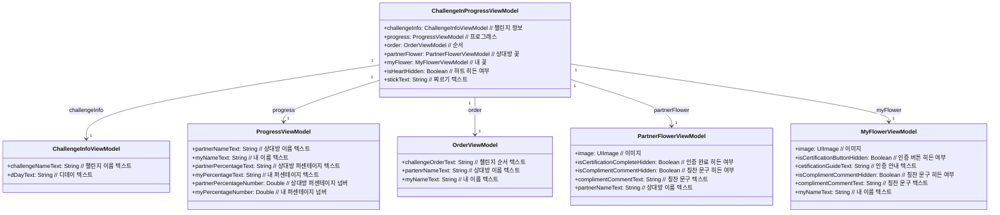

# HomeScene

## Test Scenario

| Feature  | Scenario                         | Given (전제)                                                                                 | When (조건)                       | Then (결과)                                                        | 비고                                                                                   |
| -------- | -------------------------------- | ------------------------------------------------------------------------------------------ | ------------------------------- | ---------------------------------------------------------------- | ------------------------------------------------------------------------------------ |
| 진입       |                                  |                                                                                            |                                 |                                                                  |                                                                                      |
|          | 첫 진입 - 1 (챌린지 조회)                |                                                                                            | 진입 시                            | 홈 조회를 요청한다.                                                      | [챌린지 엔티티 설계](https://www.notion.so/66db3be4ebd0401494cd4a3c0ac8d84d?pvs=21)          |
|          | 첫 진입 - 2 (챌린지 생성전)               | 홈 조회 요청 결과가 성공이다. , 챌린지 상태가 챌린지 생성전이다.                                                     | 진입 시                            | 조회된 챌린지 정보로 챌린지 정보 데이터를 업데이트한다. , 챌린지 생성전 화면을 보여준다.              |                                                                                      |
|          | 첫 진입 - 3 (챌린지 대기중)               | 홈 조회 요청 결과가 성공이다. , 챌린지 상태가 챌린지 대기중이다.                                                     | 진입 시                            | 조회된 챌린지 정보로 챌린지 정보 데이터를 업데이트한다. , 챌린지 대기중 화면을 보여준다.              |                                                                                      |
|          | 첫 진입 - 4 (챌린지 시작전)               | 홈 조회 요청 결과가 성공이다. , 챌린지 상태가 챌린지 시작 전이다.                                                    | 진입 시                            | 조회된 챌린지 정보로 챌린지 정보 데이터를 업데이트한다. , 챌린지 시작 전 화면을 보여준다.             | [챌린지 to 챌린지 시작 전](https://www.notion.so/to-a48d249b90484e709aa5b9d172ce0965?pvs=21)  |
|          | 첫 진입 - 5 (챌린지 시작일 전)             | 홈 조회 요청 결과가 성공이다. , 챌린지 상태가 챌린지 시작일 전이다.                                                   | 진입 시                            | 조회된 챌린지 정보로 챌린지 정보 데이터를 업데이트한다. , 챌린지 시작일 전 화면을 보여준다.            |                                                                                      |
|          | 첫 진입 - 6 (챌린지 시작일 초과)            | 홈 조회 요청 결과가 성공이다. , 챌린지 상태가 챌린지 시작일 초과이다.                                                  | 진입 시                            | 조회된 챌린지 정보로 챌린지 정보 데이터를 업데이트한다. , 챌린지 시작일 초과 화면을 보여준다.           |                                                                                      |
|          | 첫 진입 - 7 (챌린지 진행중)               | 홈 조회 요청 결과가 성공이다. , 챌린지 상태가 챌린지 진행중이다.                                                     | 진입 시                            | 조회된 챌린지 정보로 챌린지 정보 데이터를 업데이트한다. , 챌린지 진행중 화면을 보여준다.              | [챌린지 to 챌린지 진행 중](https://www.notion.so/to-58c7bb4879074d238f035622005fe5f5?pvs=21)  |
|          | 첫 진입 - 8 (챌린지 인증 팝업)             | 홈 조회 요청 결과가 성공이다. , 챌린지 상태가 챌린지 진행중이다. , 챌린지 진행 중 상태가 둘 다 인증이다. , 챌린지 둘다 인증 상태가 확인되지 않음이다. | 진입 시                            | 둘다 인증 팝업을 보여준다.                                                  |                                                                                      |
|          | 첫 진입 - 9 (챌린지 완료)                | 홈 조회 요청 결과가 성공이다. , 챌린지 상태가 챌린지 완료이다.                                                      | 진입 시                            | 조회된 챌린지 정보로 챌린지 정보 데이터를 업데이트한다. , 챌린지 완료 화면을 보여준다.               | [챌린지 to 챌린지 완료](https://www.notion.so/to-1b57f10957254eb1a93723b5f81a9728?pvs=21)    |
|          | 첫 진입 - 10 (챌린지 완료 팝업)            | 홈 조회 요청 결과가 성공이다. , 챌린지 상태가 챌린지 완료이다. , 챌린지 완료 상태가 확인되지 않음이다.                              | 진입 시                            | 챌린지 완료 팝업을 보여준다.                                                 | [챌린지 to 챌린지 완료 팝업](https://www.notion.so/to-bbfb24478a0049e6af17dc0271eec7eb?pvs=21) |
|          | 첫 진입 - 11 (챌린지 로드 오류)            | 홈 조회 요청 결과가 실패이다.                                                                          | 진입 시                            | 홈 오류를 보여준다.                                                      | 토스트 (서버 오류 빈도에 따라, 오류 화면도 고려)                                                        |
| 챌린지 생성   |                                  |                                                                                            |                                 |                                                                  |                                                                                      |
|          | 챌린지 기본 정보 화면 이동 - 1              | 현재 챌린지 상태가 챌린지 생성전이다.                                                                      | 챌린지 시작하기 버튼을 클릭하였을 때            | 챌린지 기본 정보 화면으로 이동한다.                                             |                                                                                      |
|          | 챌린지 기본 정보 화면 이동 - 2              | 현재 챌린지 상태가 챌린지 시작일 초과이다.                                                                   | 챌린지 시작하기 버튼을 클릭하였을 때            | 챌린지 기본 정보 화면으로 이동한다.                                             |                                                                                      |
|          | 챌린지 정보 확인 화면 이동 - 1 (챌린지 확인 - 1) | 현재 챌린지 상태가 챌린지 대기중이다.                                                                      | 챌린지 확인하기 버튼을 클릭하였을 때            | 확인(view) 진입점을 전달하며, 챌린지 정보 확인 화면으로 이동한다.                         |                                                                                      |
|          | 챌린지 정보 확인 화면 이동 - 2 (챌린지 확인 - 2) | 현재 챌린지 상태가 챌린지 시작일 전이다.                                                                    | 챌린지 확인하기 버튼을 클릭하였을 때            | 확인(view) 진입점을 전달하며, 챌린지 정보 확인 화면으로 이동한다.                         |                                                                                      |
|          | 챌린지 정보 확인 화면 이동 - 3 (챌린지 수락)     | 현재 챌린지 상태가 챌린지 시작전이다.                                                                      | 챌린지 확인하기 버튼을 클릭하였을 때            | 수락(accept) 진입점을 전달하며, 챌린지 정보 확인 화면으로 이동한다.                       |                                                                                      |
| 챌린지 완료   |                                  |                                                                                            |                                 |                                                                  |                                                                                      |
|          | 챌린지 완료 팝업 확인 - 1                 |                                                                                            | 챌린지 완료 팝업의 배경을 클릭하였을 때          | 확인함으로 챌린지 완료 확인 여부 업데이트를 요청한다. , 챌린지 완료 팝업을 닫는다.                 |                                                                                      |
|          | 챌린지 완료 팝업 확인 - 2                 |                                                                                            | 챌린지 완료 팝업의 확인 버튼을 클릭하였을 때       | 확인함으로 챌린지 완료 확인 여부 업데이트를 요청한다. , 챌린지 완료 팝업을 닫는다.                 |                                                                                      |
|          | 챌린지 완료 요청                        | 현재 챌린지 상태가 챌린지 완료이다.                                                                       | 챌린지 완료하기 버튼을 클릭하였을 때            | 챌린지 완료 요청을 한다.                                                   |                                                                                      |
|          | 히스토리 화면 이동                       | 현재 챌린지 상태가 챌린지 완료이다. , 챌린지 완료 요청 결과가 성공이다.                                                 | 챌린지 완료하기 버튼을 클릭하였을 때            | 업데이트 됨을 전달하며 히스토리 화면으로 이동한다.                                     |                                                                                      |
|          | 챌린지 완료 요청 실패                     | 현재 챌린지 상태가 챌린지 완료이다. , 챌린지 완료 요청 결과가 실패이다.                                                 | 챌린지 완료하기 버튼을 클릭하였을 때            | 챌린지 완료 요청 오류를 보여준다.                                              | 토스트                                                                                  |
| 칭찬       |                                  |                                                                                            |                                 |                                                                  |                                                                                      |
|          | 둘다 인증 팝업 닫기 - 1                  |                                                                                            | 둘다 인증 팝업의 괜찮아요(no) 버튼을 클릭하였을 때  | 둘다 인증 팝업을 닫는다.                                                   |                                                                                      |
|          | 둘다 인증 팝업 닫기 - 2                  |                                                                                            | 둘다 인증 팝업의 배경을 클릭하였을 때           | 둘다 인증 팝업을 닫는다.                                                   |                                                                                      |
|          | 칭찬하기 화면 이동 - 1 (둘다 인증 팝업)        |                                                                                            | 둘다 인증 팝업의 칭찬하기(yes) 버튼을 클릭하였을 때 | 확인함으로 둘다 인증 확인 여부 업데이트를 요청한다. , 둘다 인증 팝업을 닫는다. , 칭찬하기 화면으로 이동한다. |                                                                                      |
|          | 칭찬하기 화면 이동 - 2 (칭찬 문구)           | 현재 챌린지의 내 칭찬 문구가 빈 값이다.                                                                    | 내 칭찬 문구를 클릭하였을 때                | 칭찬하기 화면으로 이동한다.                                                  |                                                                                      |
| 인증       |                                  |                                                                                            |                                 |                                                                  |                                                                                      |
|          | 인증하기 화면 이동                       | 현재 챌린지의 나의 오늘 인증 정보가 존재하지 않는다.                                                             | 내 꽃을 클릭하였을 때                    | 인증하기 화면으로 이동한다.                                                  |                                                                                      |
| 찌르기      |                                  |                                                                                            |                                 |                                                                  |                                                                                      |
|          | 찌르기 화면 이동                        | 현재 챌린지의 찌르기 남은 횟수가 1개 이상이다.                                                                | 찌르기 버튼을 클릭하였을 때                 | 찌르기 화면으로 이동한다.                                                   |                                                                                      |
|          | 찌르기 횟수 초과                        | 현재 챌린지의 찌르기 남은 횟수가 0개이다.                                                                   | 찌르기 버튼을 클릭하였을 때                 | 찌르기 횟수 초과 오류를 보여준다.                                              | 토스트                                                                                  |
| 챌린지 히스토리 |                                  |                                                                                            |                                 |                                                                  |                                                                                      |
|          | 챌린지 히스토리 화면 이동                   |                                                                                            | 챌린지 정보를 클릭하였을 때                 | 챌린지 히스토리 화면으로 이동한다.                                              |                                                                                      |
| 설명서      |                                  |                                                                                            |                                 |                                                                  |                                                                                      |
|          | 설명서 화면 이동                        |                                                                                            | 설명서 버튼을 클릭하였을 때                 | 설명서 화면으로 이동한다.                                                   |

## Entity

### 챌린지

### 챌린지 생성 전

### 챌린지 대기 중

### 챌린지 시작 전

### 챌린지 시작일 전

### 챌린지 시작일 초과

### 챌린지 진행 중

### 챌린지 완료

### 둘다 인증 팝업

### 챌린지 완료 팝업

## Mapping Scenario

### 챌린지 to 챌린지 시작전

| Scenario | Given (전제)                | Then (결과)                                                              |
| -------- | ------------------------- | ---------------------------------------------------------------------- |
| 내 닉네임    | 내 정보의 닉네임이 “Test” 이다.     | 내 이름 텍스트가 “Test” 로 표현된다.                                               |
| 상대방 닉네임  | 상대방 정보의 닉네임이 “Test” 이다.   | 상대방 이름 텍스트가 “Test” 로 표현된다. 타이틀이 “Test님이 보낸 \\n챌린지를 확인해주세요” 로 표현된다.     |
